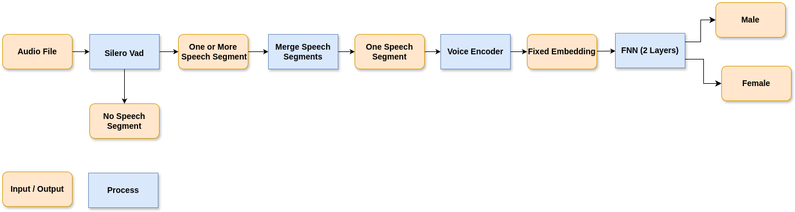

# Gender Classification Task

This project implements an end-to-end pipeline for classifying the speaker's gender (male or female) from audio files. It leverages the pre-trained Silero Voice Activity Detection (VAD) model to isolate speech segments and utilizes speaker embedding models (ECAPA-TDNN, Resemblyzer, Wav2Vec) combined with a custom feed-forward neural network (FNN) to perform robust gender classification. The system effectively handles common audio challenges, including background noise, prolonged silences, varying volumes, and differing audio lengths.

---

## Table of Contents
- [Project Overview](#project-overview)
- [Project Structure](#project-structure)
- [Installation and Setup](#installation-and-setup)
- [Running the Pipeline](#running-the-pipeline)
- [Results](#results)

---

## Project Overview

The goal of this project is to create a reliable audio processing pipeline to:

1. **Process input audio files** (handling noise and silence).
2. **Detect speech segments** using Silero VAD.
3. **Extract speaker embeddings** via pre-trained voice encoders:
   - ECAPA-TDNN (192-dimensional)
   - Resemblyzer (256-dimensional)
   - Wav2Vec (768-dimensional, time-averaged)
4. **Classify speaker gender** using a custom 2-layer FNN.

### Pipeline Flow



**Step-by-step description:**
- **Audio Input**: Handles raw audio input, potentially noisy or inconsistent.
- **Speech Detection (Silero VAD)**: Identifies speech segments; exits early if speech isn't detected.
- **Segment Merging**: Combines identified speech into continuous audio segments.
- **Embedding Extraction**: Generates speaker-specific embeddings using voice encoders.
- **FNN Classifier**: A neural network classifies gender based on embeddings.
- **Output**: Provides gender prediction (Male/Female).

### Voice Encoder Comparison

The evaluation revealed:
- **Resemblyzer** achieved the highest accuracy (98.00%).
- **ECAPA-TDNN** showed strong performance (97.83%).
- **Wav2Vec** underperformed due to its linguistic rather than speaker-specific focus.

---

## Project Structure

The project directory is structured for clarity and ease of use:

```
.
├── docs/                       # Documentation and diagrams
│   ├── pipeline.drawio
│   ├── pipeline.png
│   ├── Report.pdf
│   └── Speech_assignment.pdf
├── models-embeddings/          # Embeddings & UMAP visualizations
│   ├── ecapa-embeddings.jsonl
│   ├── ecapa-embeddings.png
│   ├── resemblyzer-embeddings.jsonl
│   ├── resemblyzer-embeddings.png
│   ├── wav2vec-embeddings.jsonl
│   ├── wav2vec-embeddings.png
├── post-analysis/              # Misclassified audio files for detailed analysis
│   ├── ecapa/
│   │   ├── test/
│   │   ├── train/
│   │   └── val/
│   └── resemblyzer/
│       ├── test/
│       ├── train/
│       └── val/
├── runs/                       # Training logs & best-performing models
│   ├── ecapa-2025-03-23_19-14-13/
│   └── resemblyzer-2025-03-23_19-14-09/
├── src/                        # Source code and scripts
│   ├── audio-analysis.ipynb
│   ├── plot_models_embeddings.py
│   ├── save_models_embeddings.py
│   └── train.py
├── README.md                   # Project overview and instructions
└── requirements.txt            # Python dependencies
```

---

## Installation and Setup

Follow these steps to get the project up and running:

### Step 1: Clone the Repository

```bash
git clone <repository-url>
cd Gender-Classification-Task
```

### Step 2: Set Up Environment

```bash
conda create -n gender-classification python=3.12
conda activate gender-classification
```

### Step 3: Install Dependencies

```bash
pip install -r requirements.txt
```

---

## Running the Pipeline

Execute the following scripts as needed:

- **Embedding Extraction:**
  ```bash
  python src/save_models_embeddings.py
  ```

- **Train Classifier:**
  ```bash
  python src/train.py
  ```

- **Generate UMAP Plots:**
  ```bash
  python src/plot_models_embeddings.py
  ```

- **Audio Analysis (Jupyter Notebook):**
  Open `src/audio-analysis.ipynb` in Jupyter Notebook.

---

## Results

### Performance Summary

| Voice Encoder | Total Epochs | Best Validation Loss | Test Accuracy | Test Loss | Early Stopping |
|---------------|--------------|----------------------|---------------|-----------|----------------|
| ECAPA-TDNN    | 57           | 0.1043               | 97.83%        | 0.1078    | Yes            |
| Resemblyzer   | 78           | 0.0898               | 98.00%        | 0.0718    | Yes            |

### Key Observations

- **High Accuracy:** Both models delivered accuracy exceeding 97%.
- **Model Comparison:** Resemblyzer slightly outperformed ECAPA-TDNN.
- **Misclassification Analysis:** Errors often stemmed from mislabeled dataset entries or challenging audio scenarios (background music, overlapping speech).
- **Embeddings Visualization:** Provided via UMAP plots in `models-embeddings/`.
- **Training Insights:** Detailed logs available in TensorBoard (`runs/` folder).

---


